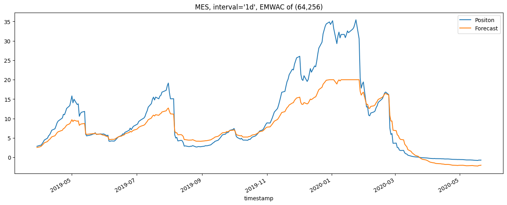
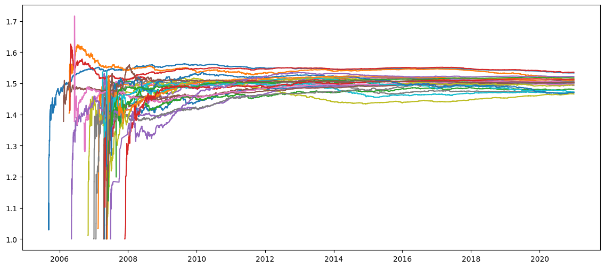

## 1. SubSystem Positioning

```python
es = Instrument(meta= cme.es.f, interval="1d")
es_ss = SubSystem(instruement=es, forecasts=forecasts, daily_cash_vol_tgt=6250.0 * 2 # IDM)

pos = es_ss.positions
cfs = es_ss.instrument.cfs
pos = pos[pos.index.year.isin([2019,2020])]
cfs = cfs[cfs.index.year.isin([2019,2020])]
pos = pos.iloc[60:350]
cfs = cfs.iloc[60:350]
import matplotlib.pyplot as plt
pos.plot(label="Positon", figsize=(16,6))
cfs.plot(label="Forecast", figsize=(16,6))
plt.title("MES, interval='1d', EMWAC of (64,256)" )
plt.legend()
```

<p align="center">
  
  <br>
  <em>MES, interval='1d', EMWAC of (64,256)</em>
</p>


## 2. Position Sizing (Not-Risk Weighted)

```python
tickers_5m = [
    cme.ke.f,
    cme.zc.f,
    cme.zl.f,
    cme.zm.f,
    cme.zs.f,
    cme.zw.f,
    cme.cl.f,
    cme.ho.f,
    cme.ng.f,
    cme.rb.f,
    cme.es.f,
    cme.nq.f,
    cme.rty.f,
    cme.ym.f,
    cme.zb.f,
    cme.zf.f,
    cme.zn.f,
    cme.zt.f,
    cme.gf.f,
    cme.he.f,
    cme.le.f,
    cme.gc.f,
    cme.hg.f,
    cme.pa.f,
    cme.pl.f,
    cme.si.f,
]

forecasts = [
    EWMACForecast(fast_window=2),
    EWMACForecast(fast_window=4),
    EWMACForecast(fast_window=8),
    EWMACForecast(fast_window=16),
    EWMACForecast(fast_window=32),
    EWMACForecast(fast_window=64),
    EWMACForecast(fast_window=128),
    EWMACForecast(fast_window=256),
    EWMACForecast(fast_window=512),
]

portfolio = Portfolio(forecasts=forecasts, contracts=tickers_5m, interval="5m", capital=100_000)


import matplotlib.pyplot as plt

plt.figure(figsize=(14, 6)) 

for ss in portfolio.subsystems:
    plt.plot(ss.instrument.fdm)
```

<p align="center">
  
  <br>
</p>
